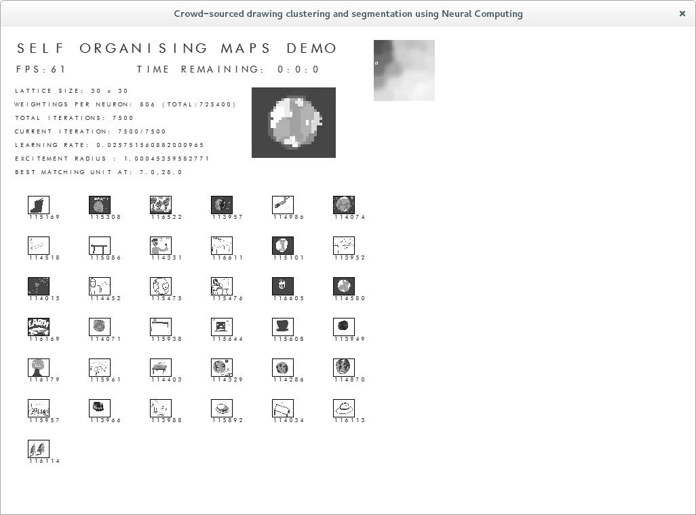
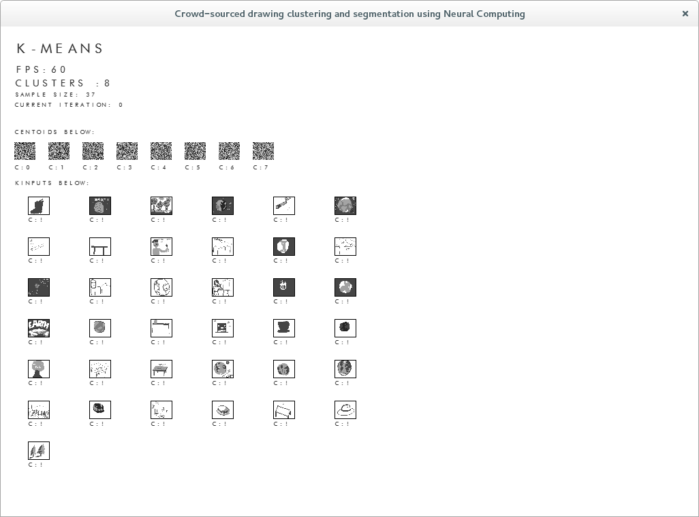

So I'm a lot further into my dissertation, with not as much progress as I'd have liked (I got pretty ill and I have to focus on multiple modules not just the one). But overall it's progressing smoother. Since Christmas I've been refactoring a lot of code, I've cleaned everything up and it's a lot more object-orientated in focus now.

This happened when I realised that a few things are shared amongst K-Means and the Self-Organising Map, small things like weightings etc. The point being the project is quite expandable it can even take new inputs if desired.  I think I understand the direction that my project is heading in as well which is a lot better than where I was before Christmas.

I've still got to rework the spherical implementation, but here's a screenshot of it. It's also now running the Trainer separately in a thread (which I should have done to start with), it lets me use a lot more nodes in my lattice and thus I can have a large sample if desired.

K-Means is being a bit strange, I tried to make it work with Earth Movers Distance but it just slowed to a crawl. Euclidean distance seems to run fast, but not produce the correct images. Maybe I should be using K-Means on the SOM instead? with euclidean distance? I'm not too sure and I'm seeing my supervisor about it soon.

I did a few things to this site too and I've been fiddling with Something Petty hopefully I'll have something to show for it soon.

Oh yeah and I finished another website,  have a look! [https://comedybeats.com](https://comedybeats.com)
