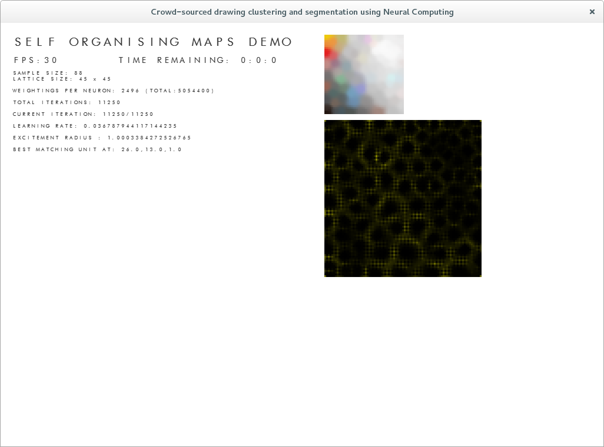

Pretty small in the grand scheme, I wonder if I use a growing som whether it will be more efficient. The auto-clustering is also a pretty enticing feature.

I was also thinking that I might be able to put the whole thing into chunks, the problem is the number of neurons being held in memory is waaay too high at the moment. 

I could load Neurons in periodically in some kind of grid to check them against the best matching unit, I mean maybe that would work? I guess if only a 10x10 region is loaded at one time it might run smoothly enough.
