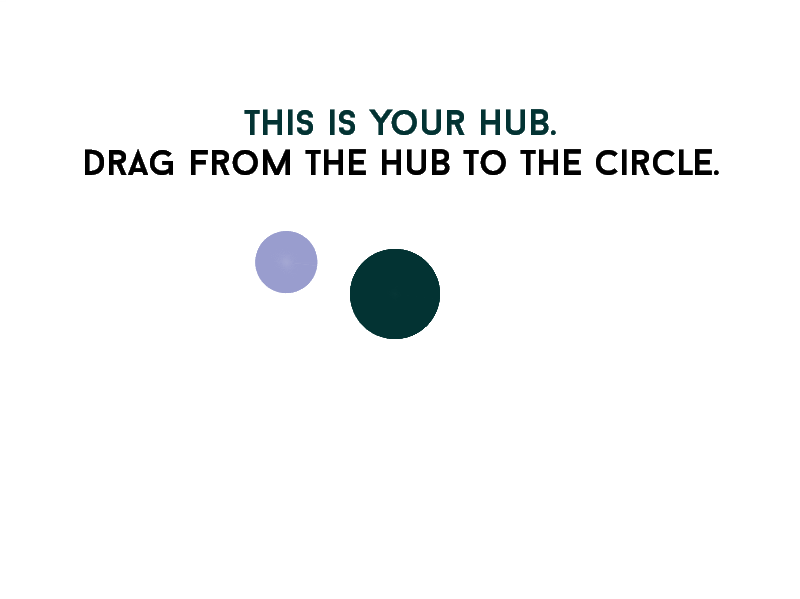
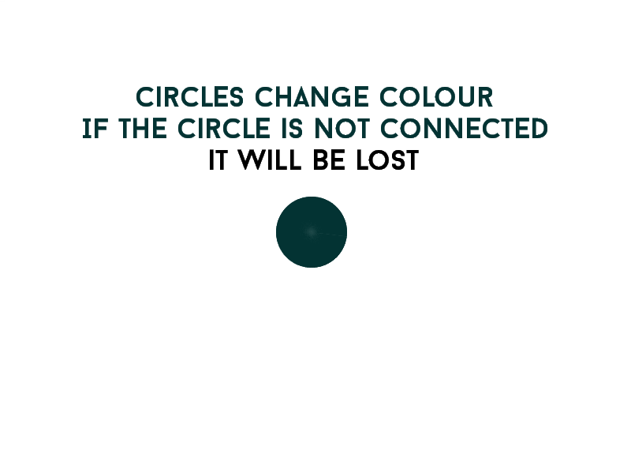

Here's what I've been working on the past couple days (on and off work).

The game is pretty simple. You have a hub, you connect circles to the hub. If the circle isn't connected it will be lost. Circles change colour over time and break their connections naturally. Hold onto as many connections as you can by the end of the time limit.

Game has music by Sarah Hargreaves again and will probably be done very soon.

Its called "Holding it together".

Thats all for now I'll prolly put it on itch sometime soon.

