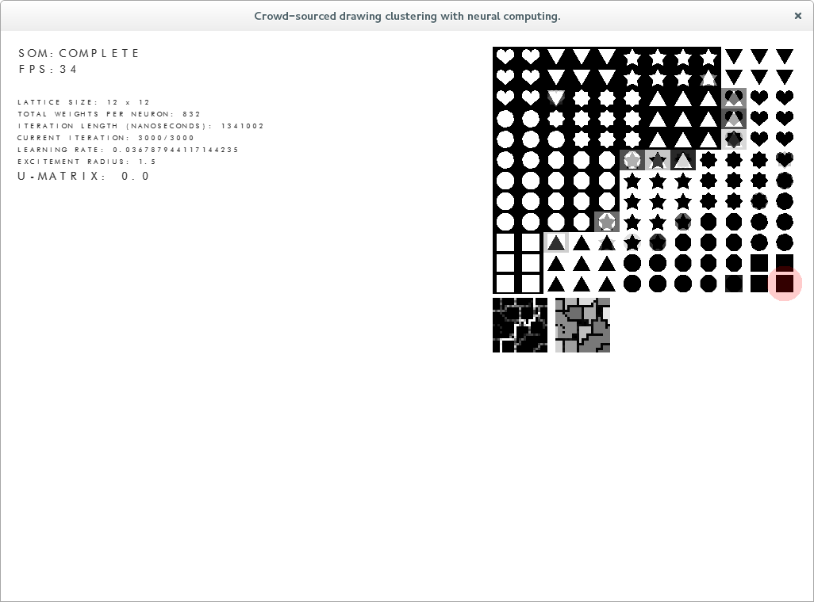

I've got 16 days till my birthday and dissertation hand in. I've thrown together a new version again, it can run headless now.

I was really hoping to emulate the SOM with K-Means (have a look for "Fast Emulation of Self-Organizing Maps for Large Datasets") and use The Earth Mover's Distance as my distance metric, but with only 16 days to finish writing it I need to stop writing code now and finish the write up.

Here's a pretty picture of both the SOM and K-Means. I hope to go a bit further with this once everything is over and done and use a proper convolutional neural network like I wanted to at the start. It'll be outside the scope of the dissertation, but I'll write it up and produce results that can be compared.

