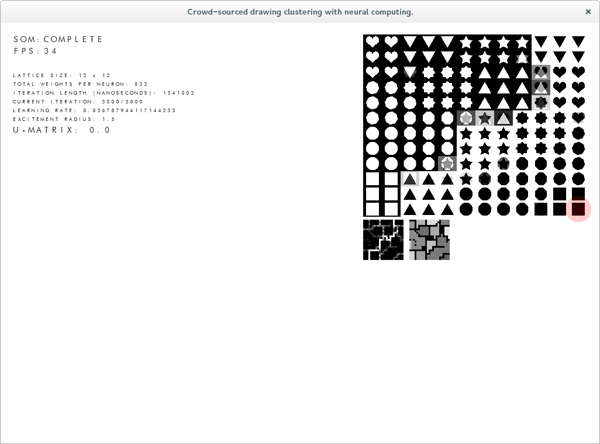

I've been putting this off for waaaaaaay too long, but next week is my hand-in so I finally sat down and did it.

Pretty much, the U-Matrix (small box on the left) measures distance between nodes in the map and the one next to it fills in the gaps with a flood fill algorithm. Each region that is filled becomes a cluster and locating the cluster which an input belongs to is as simple as calling the best matching unit for that input and finding its x and y in the new filled region.

But at long last its done and its giving okay results too. I wish I had a couple more months to include some deep learning bits in there as well, but sadly I don't. Maybe for future research? (to be continued..?)
