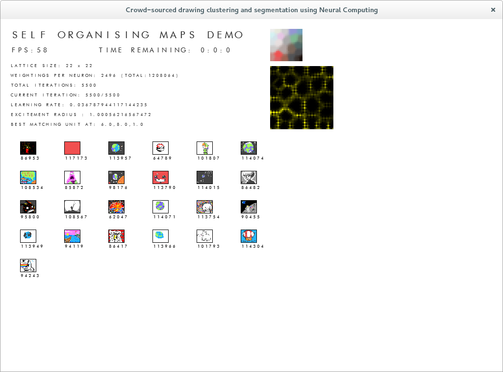

Colour inputs are now a thing. I've gotta fiddle with my K-Means implementation to get it to accept them but its looking good in the self-organsing map. Time to try and enhance performance for larger datasets.

Black and white with U-Matrix below.

The star of the show, colour inputs.

