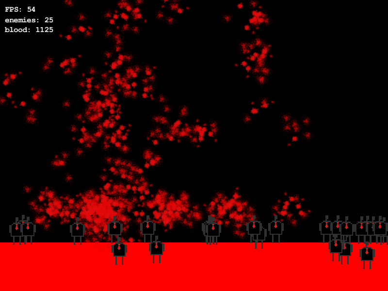

On Wednesday I went out to Picaddly to go to the BAFTA Games Question time which was awesssssssssssssome! 
I drank a bit too much and ended up hugging Mike Blithell (sorry). Met a bunch of really awesome people and I am definitely going to go to one of the meetups sometime. 
I got to meet Sushun and Hanary whom I'd only met over Twitter (also super weird). 

After stumbling home I finished off some work and did some revision, started work on a weird little thing:

Not sure what I'm going to make it about, if anything, but its neat anyway. Might make it a sidescrolling running game who knows.

I also uploaded a video pertaining to Darkness Exhumed the other week.

`video: http://www.youtube.com/watch?v=-1XNmQJ2BBE`
