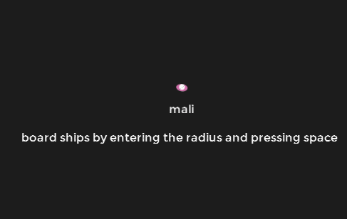

I couldn't think of anything more creative for the title. My bad.

I moved in, its a pretty damn sweet house. No wifi yet and I move my computer in tomorrow, which is why I haven't been working on anything the past week.

Seriously though it is such a nice house and the people are lovely. First night was a tiny tiny tiny bit weird, but I think its sorted now and even if its not I'm sure it'll be sorted soon.

I even had someone from back home come over and I'm having Sarah come up next week. She can show me some of the music shes been working on for Jealous Rectangle which might remotivate me for it.

I started on an Android port of Sol, which I think I mentioned last time. I stopped cause I got bored, I'm not good at sticking to things. Instead I started on this thing I had bumbling around for ages and wasn't sure how to approach. Well I was, but I wasn't.

Heres the old version.
`video: https://www.youtube.com/watch?v=fAiD6r3qUnE`

But that had so many flaws its unbelievable I thought it was even remotely acceptable.

This new thing, can have any ship design I like. Dependant on the tiles. It is going to be kick-ass.

Need to test it over a network sometime, but it works really well locally. Those red circles are doors and basically activate collisions and put you inside the ship. If you go near the captains computer, you start to pilot the entire ship (I'll make it dependant on thrusters or something eventually). The thing is, the game is multiplayer. So that means you can all board the ship and move around while someone pilots it. I plan on making it similar to Faster than light (awesome game, go buy it if you haven't), but with multiplayer. You'll go around and fight enemy ships or maybe even each other onboard opposing ships. I want to add penalty for being outside too long, engineering bays, weapons etc.

THIS ALL DEPENDS HOW NETWORK TESTING WORKS OUT. If that proves to be laggy and I've done a piss poor job I probably won't continue it. But I think I haven't.

Other real life stuff includes why I'm back home. I did manly manly work today and yesterday, sawing logs and cutting trees. I think I trod on a mouse and I nearly cut the dogs head off but its all good (dog is still alive).

I'm looking forward to going back tomorrow to the house with my gamecube and pc, it does get a little bit boring and I probably drink too much when I'm bored. My appetite has reduced since I went back which is kinda strange and I think I'm sleeping less but that might just be the bed. Not sure yet.

THATS ALL FOR NOW LOTS OF THINGS TO DO PACKING AND STUFF WILL UPDATE WHEN I GET MORE INTERNET.
