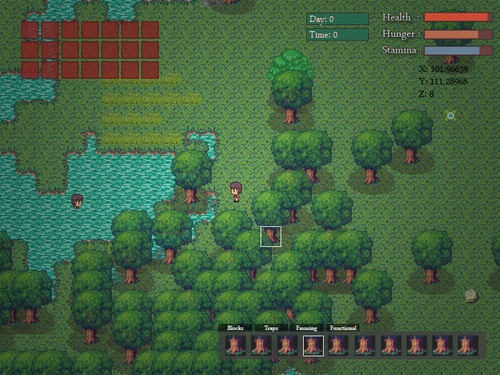

New art has been added to the game, along with resource packs.

I’m very excited to have more art added, as I personally find it lovely.

I’ve been pretty lazy over the past week, but I hope to turn that around by finishing up re-adding a couple old features.

Once thats done there will be a whole range of updates as I work on combat, bosses, items and buffs/debuffs.

The game will enter alpha-testing at that stage and I will start recruiting testers, before releasing the beta build for £2.50.

Heres to the future! *clinks glass*
