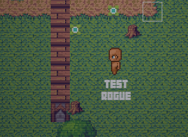

Got so much work done yesterday. Mostly towards Reclaimed, but also on an engine that me and a friend are developing for creating ORPG's. Overslept this morning, missed my lecture but thankfully it was only about Assembly which I got a healthy dose of in my a-level electronics. Its probably the only thing in electronics that I was good at. >.<

I would like to get back into it at some point, but I've ordered a whittling kit hopefully going to make some cool cog things with that.

**I added collapsing walls! Thats a thing now! Posted that yesterday but heres another gif.**

Big thanks to my new artist Andii. He's been a great help. Got some more art left, but soon I should have it and the music in the game within the next day or two.

I started work on the website, its not done but its on its way.

I've got to add a couple things to the game and clean up some of the interfaces/polish the heck out of it. Then this weekend I hope to have a build for press and testers.

If you're interested in testing the game with me, my team and potentially some press, drop me an email. malii.coxon@gmail.com

I've nearly finished the itch.io page, so that'll go live with the game on the 6th February.

Trying to develop more attention to the game, its just tough to do without these last bits.

