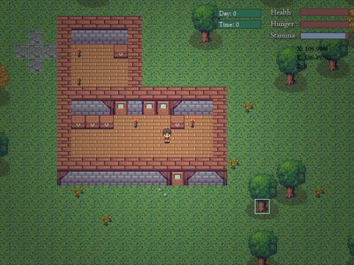

Finished re-coding the placement system, added the new chest block and threw in the new graphics for stone walls, chests, doors, torches and wooden flooring. I am loving the new graphics! Going to start redoing the entity system tomorrow, so expect a screenshot of large amounts of zombies!

