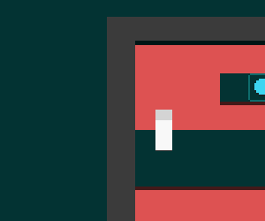
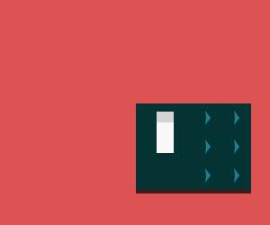

So theres a new version of Jealous Rectangle out! You can now edit levels and create your own.

This will probably be the last open alpha before the final version which will cost £1.00.

Here's the changelog for version 0.5:

additions

* extra character animation
* 3 new levels
* a full level editor, with the ability to save and load levels.
* awesome splash screen
* new button mechanic

changes

* slight tweaks to how the character moves
* green fog now a smaller denser cloud of non-rotated rectangles.
 

[You can download a copy from the itch.io page here.](http://slowpoke.itch.io/jealous-rectangle)

[Website](http://malicoxon.co.uk/jealous_rectangle/)

Enjoy and remember to give feedback if you can! <3

