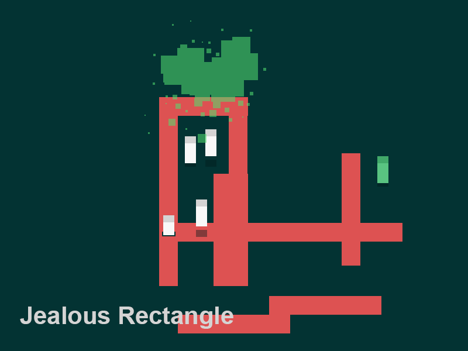

Okay so the game is about a rectangle and jealousy. Pretty straightforward.

The game uses momentum and jumping to navigate through the levels, avoiding the green smog which chases behind you and also avoiding falling into the red.

Here's a video of what the movement looks like.
`video: https://www.youtube.com/watch?v=0o-DVMeNs7Y`

You have to navigate to your goal, another rectangle who you think is with the green rectangle. Green in every instance, rectangle and smog representing jealousy. From Shakespeares Othello, "It is the green-ey'd monster, which doth mock".

Maybe I'll call it "Green-ey'd monster". Doesn't seem to work as well.

Here is a mockup.

Thats all for now though. Should have a working prototype soon-ish.
