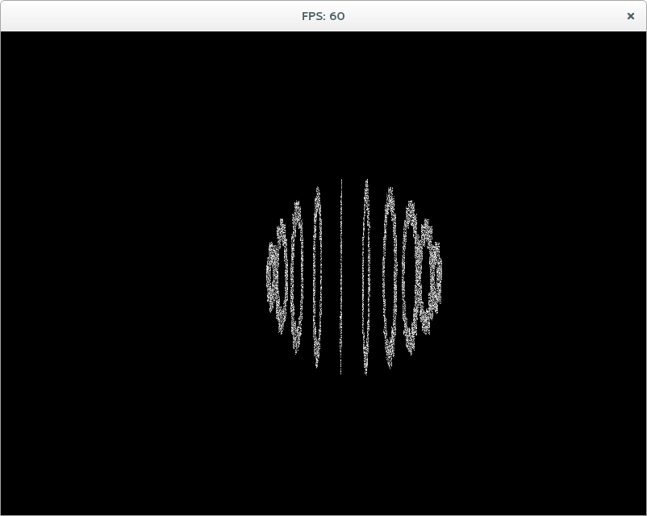
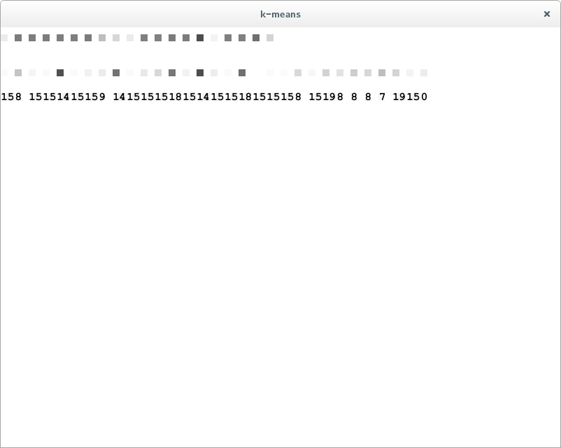
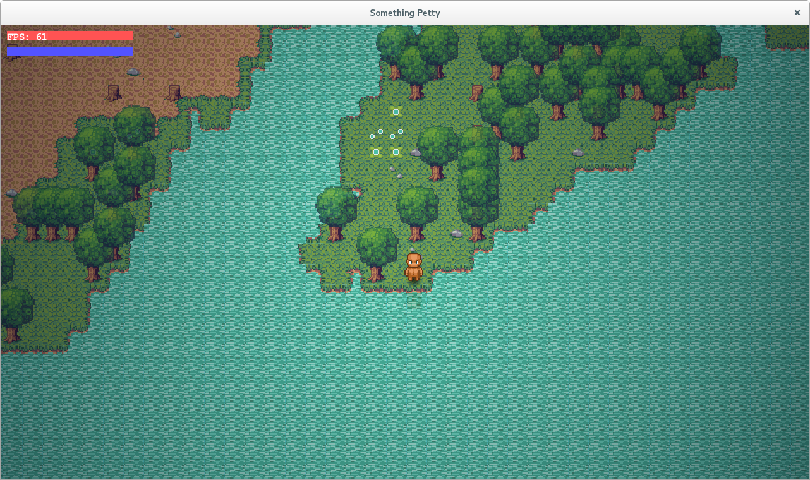

I've been working mostly on my dissertation, I have fallen behind in a couple other bits and pieces which I desperately need to catch up on but this weekend is already looking fairly busy o.O

These are just a couple screenshots from here and there, progress towards using a sphere instead of a flat plane for my self-organising map.

And some more of k-means. A lot of this is work in progress so please remember that a lot of it might not make sense at first.

AND FINALLY, for some lovely graphical stuff I've been working on Something Petty. A persistent survival multiplayer game with building and factions.

K-Means is being a bit strange, I tried to make it work with Earth Movers Distance but it just slowed to a crawl. Euclidean distance seems to run fast, but not produce the correct images. Maybe I should be using K-Means on the SOM instead? with euclidean distance? I'm not too sure and I'm seeing my supervisor about it soon.

I did a few things to this site too and I've been fiddling with Something Petty hopefully I'll have something to show for it soon.

Oh yeah and I finished another website,  have a look! [https://comedybeats.com](https://comedybeats.com)
