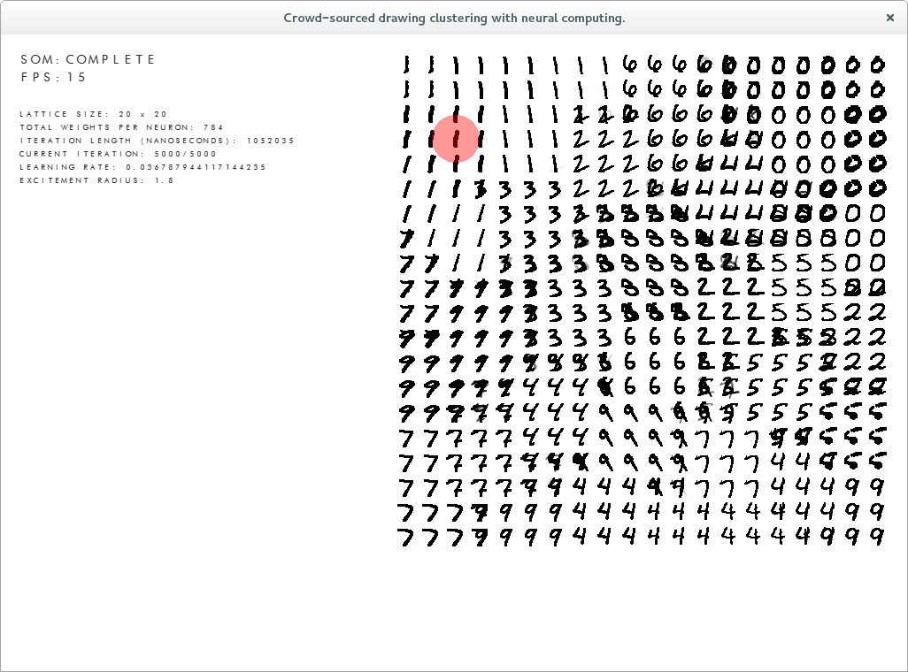

So the MNIST dataset is now included in my dissertation as a reference to see how well the SOM and other clustering methods are working.

It looks a little bit squiffy, but I'm sure once the topographic error is calculated and a perfect lattice size is given it'll smooth out (hopefully).
