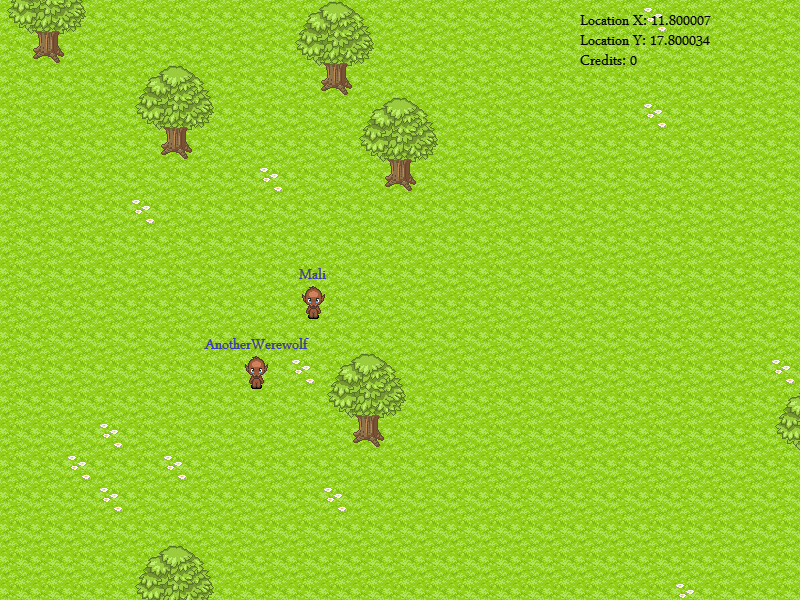

So theres a few things that have happened recently. One of my modules in my Computer Science course requested (I think it was a request) that I create a blog on my hosting, so instead of creating a brand new one I've moved the old one over from Tumblr to here.
 
 I went home this Tuesday and stayed till today, never really appreciated how good our house is compared to where I'm living at the moment (also I ate a ton of food).

And the last thing...

Just in time for Halloween I've started a a Werewolf game which I hope to have finished soon. The games premise is comparable to Orcs Must Die (in some respects). Essentially the task of the game is to choose a team, Werewolf or Human. 
If you choose human you have 1 minute to prepare for the werewolf team (this involves setting up traps with your teammates, you have no weapons and its dark. 

Once the 1 minute is up you must survive for a set amount of time before it is classed as a human win. If you are playing as a werewolf you have 1 minute of waiting in a dark room and you get 1 life. Your goal as a werewolf is to kill as many of the other team as possible.
 
 If the humans dont survive the set amount of time it is classed as a werewolf victory. The game is fairly simple and pretty easy to program aswell, the hardest section of the project is probably going to be the combat (which I'm going to reuse in Darkness Exhumed if it is good), the combat will hopefully be very fulfilling and exciting (I mean it is the main part of the project). Below I include a screenshot of the game as it stands (Design for all of it is a work in progress and the game is currently using an old temporary art style).

