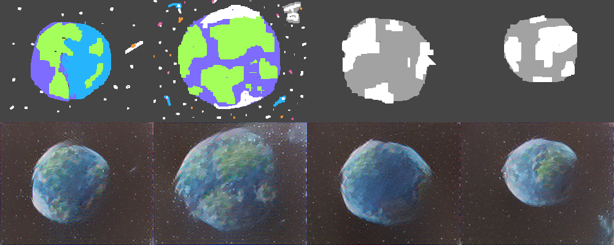
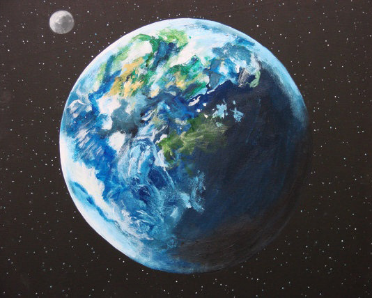

Nooodle?

[I played with this program made by Alex J. Champandard.](https://github.com/alexjc/neural-doodle) Paper is included under his name.  Its really really cool and super easy to get running.

**It's all his, all I've done is use it with some of my sample images for my dissertation.**

Its a really small python program and uses a deep neural network.  It took me a fair while to set it up since I've never used Python before, but once I got it running I was pretty happy with the results.

Essentially I took each of the colours in the following images and made up these "annotation" files with them, I coloured over the picture of the earth to also annotate which regions are where in the doodles.

All the doodles are from [InTheBottle.co.uk](https://inthebottle.co.uk), the painting is from Etsy (I was just searching for paintings of earth, can't find the original now sorry).

I used the drawings from InTheBottle.co.uk from the sample set originally designed for my dissertation.

Here's the painting used, I'm running it through with photo of earth at the moment and I'll post more things later!

Bigger images for an input would probably help here a lot and I'll write a bit more when I'm back later!
