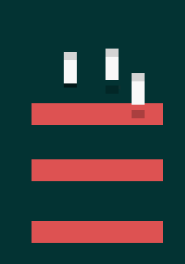

I think my biggest issue the past few weeks is lack of stuff to keep my mind busy. The past two days I was making a website for a buddy of mine and I got so involved in it, it was great. I feel so much better about myself. So much happier. Just that new project feeling is amazing and then having the finished project in two days gives me the secondary boost.

I love programming so much.

The site had all these cool nifty tricks in it too. The scanlines were divs that were moved via javascript, the logo was actually rendered with HTML5 so I could edit the RGB values on the fly and the background was edited with javascript too. The site was intended to look like the menu of the game and I think I did a great job.

[Site can be viewed here.](https://malicoxon.co.uk/portfolio/technicolour/)

[Final site](https://sleepystudios.net/superstatic/)

I really like the idea that I can add "Website created by Mali Coxon" at the bottom of pages I develop and have a consistent mark of my work. Slowly I shall spread out amongst the internet! >:3

I'm going to finish up the Holding it together game. I have some ideas bumbling about a game related to jealously. In fact I have a small screenshot of some "art-styles" (if you can call them that) I was playing with.

Game would probably be a jumping puzzle game with momentum. I have thought about maybe making it in Unity, who knows.

