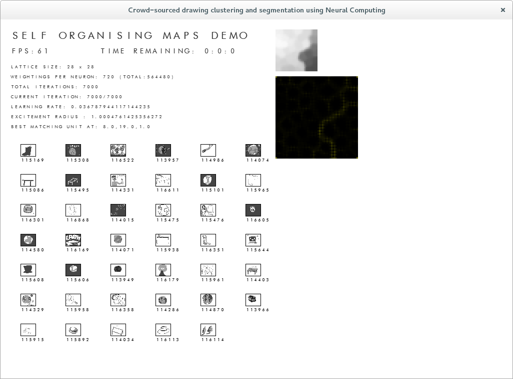

See the U-Matrix on the side? The black thing with really faint lines, they are supposed to be faint because they represent distance between nodes. 

There is a clear distinction between where the darker images end and the lighter begins and this output can be used to segment the clusters contained.

The error I think was that I wasn't dividing the value of the U-Matrix by 255, thus enhancing smaller defects.

