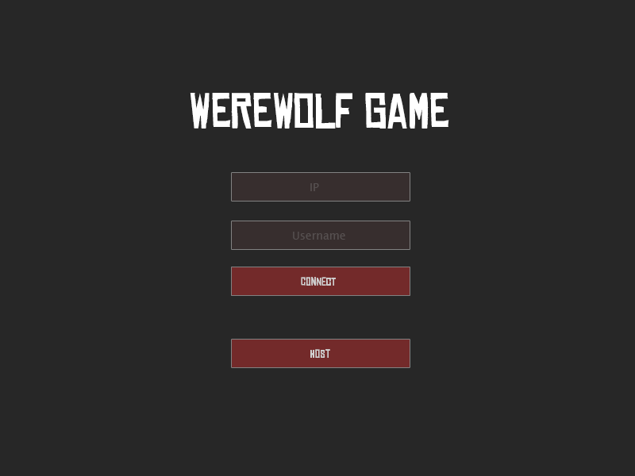
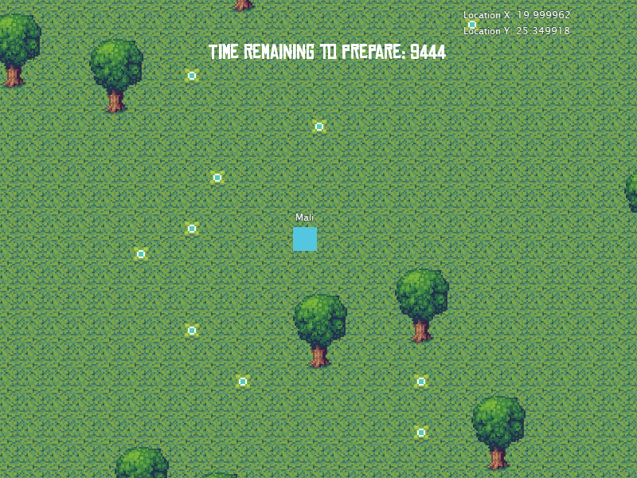
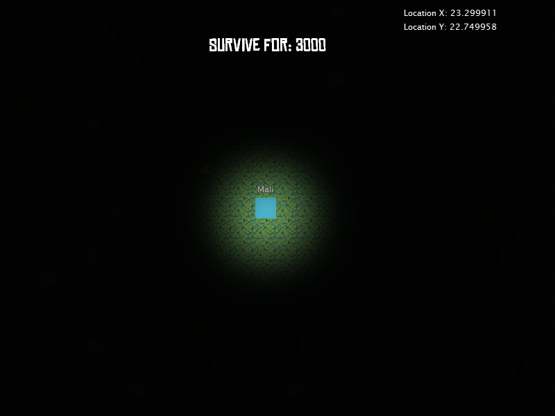

Coming together slowly, got a menu, connections and very basic attack code. I've reused Darkness Exhumed graphics (because I suck at creating them) but changed the sprites to squares (so its slightly different).  I've added a lobby system to the game so everyone can connect before the game starts. The server will be auto-assigning the teams and I might add the option to change teams later. The only things left before a small test version is a better attack system and trap placement/damage.

